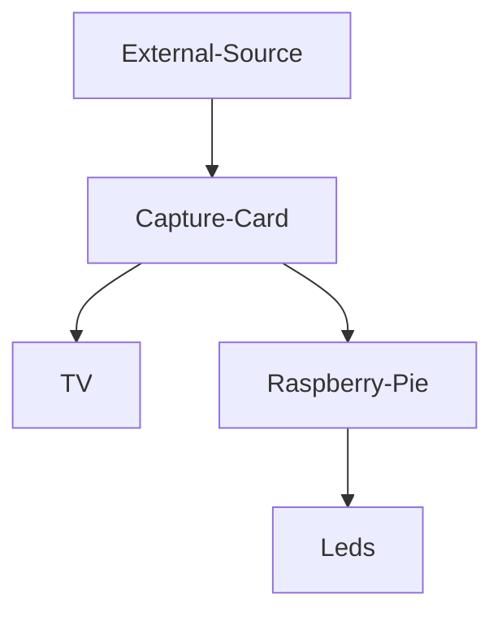
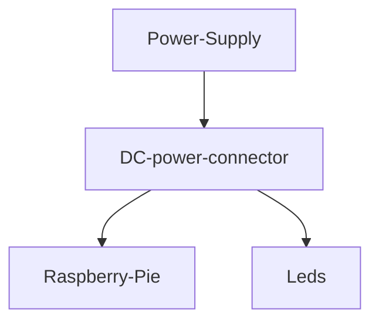

# Ambilight-TV
General guide to how to make Ambilight to your non-phillips TV with pictures and demonstration, using [raspberry pie](https://www.raspberrypi.com/products/raspberry-pi-zero/) and [hyperion](https://docs.hyperion-project.org/en/user/Installation.html) software. (Known also as back-light TV).

## Intro
Hue Ambilight is known feature in [phillips' TV](https://www.youtube.com/watch?v=aH-4HxWgk1k). The TV equipped with back RGB leds behind the TV, they dynamically change the colour by the current value of the edge pixels of the TV's image. It began when I was impressed in personal from ambilight in my friend TV house. 
ecause this kind of TVs are usually more expensive, I decided to build my own ambilight to my non-phillips TV setup and share the result with some tips and info about the process.
Enjoy. 
Credits 
- ["The ULTIMATE Guide to Building an Ambilight TV with Hyperion"](https://www.youtube.com/watch?v=J26oYlKyq7Q) by ["Everything Smart Home"](https://www.youtube.com/c/EverythingSmartHome) 
- [Hyperion](https://docs.hyperion-project.org/en/user/Installation.html) Software to run on the raspberry pie which control the lights.
#### Important Notes:
 -  This will work only if your source is external to the TV (like Xioami Streamer, Xbox Console or Blueray player), won't work for Smart-TV internal applications. In other words, if you play Netflix through your Xbox, it is OK, but if you play it from your Smart-TV's internal device, you won't see the ambilight effect.

## Table Of Contents
  * [Requirments](#requirments)
    + [List Important Items to have (or To Order)](#list-important-t--or-to-order-)
  * [Setup](#setup)
  * [Demo](#demo)

<small><i><a href='http://ecotrust-canada.github.io/markdown-toc/'>Table of contents generated with markdown-toc</a></i></small>

## Requirments
A short list of everything you will need for the BackLight leds TV project
Links are suitable for shipping to Israel. Once you have all you good to go.
- A Television (Obviously)

### To Order List (If you don't have already by chance)
- [ ] [4K Video Capture](https://www.aliexpress.com/wholesale?catId=0&initiative_id=SB_20220911092523&origin=y&SearchText=4K+USB+3.0+Video+Capture+Card+HDMI-compatible&spm=a2g0o.detail.1000002.0) - should looks 
- [ ] option 2

## Setup
graph of general setup 

flowchart of the power of the setup

## Demo
