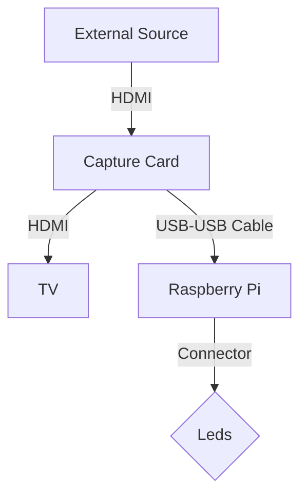
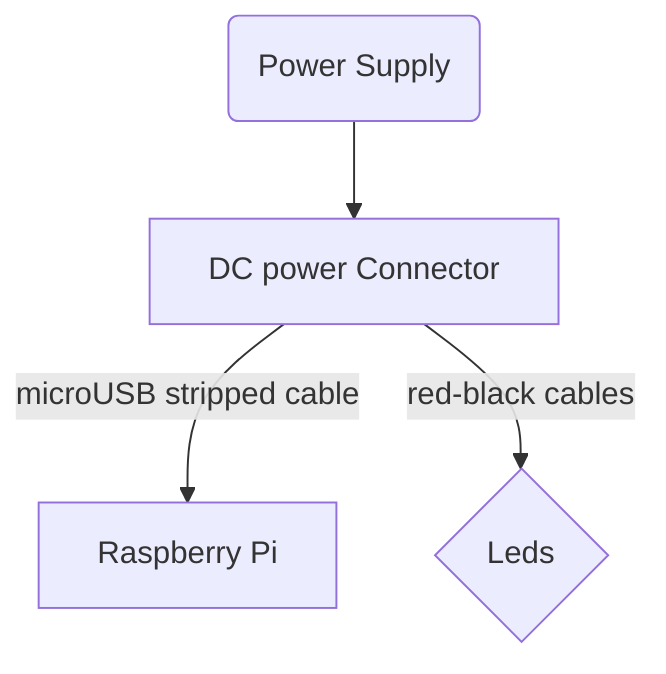
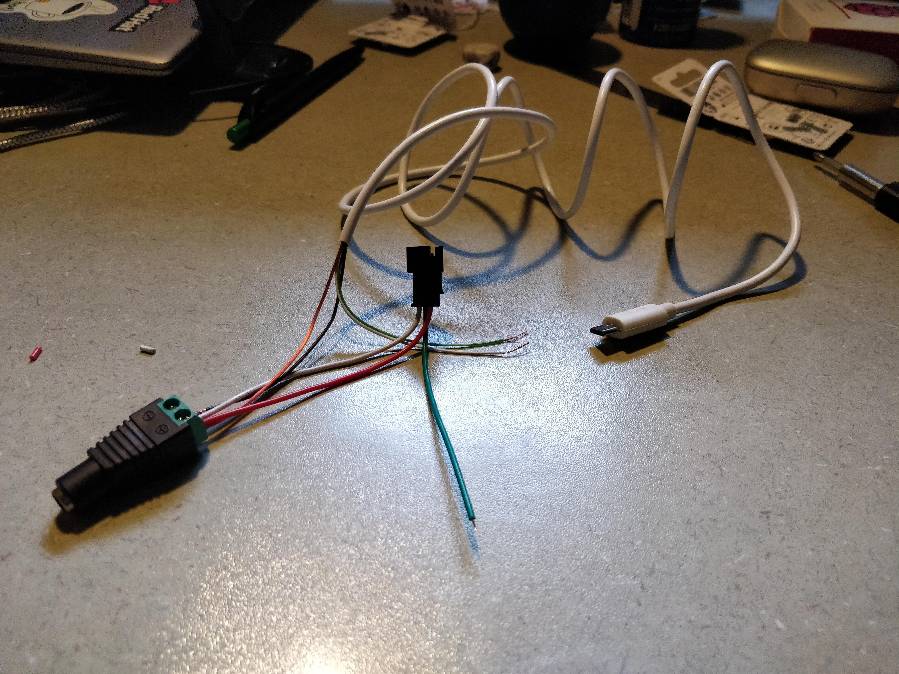
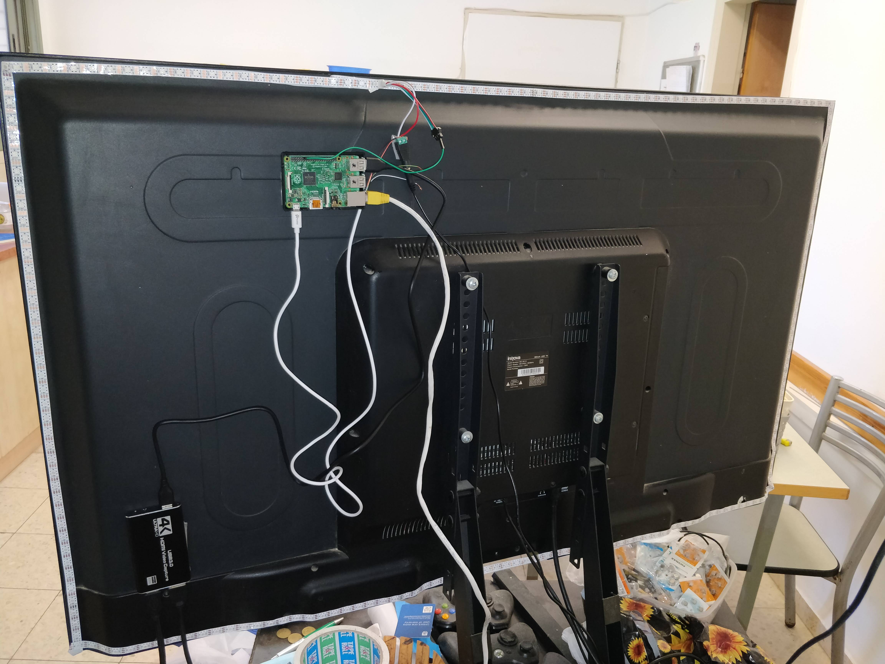
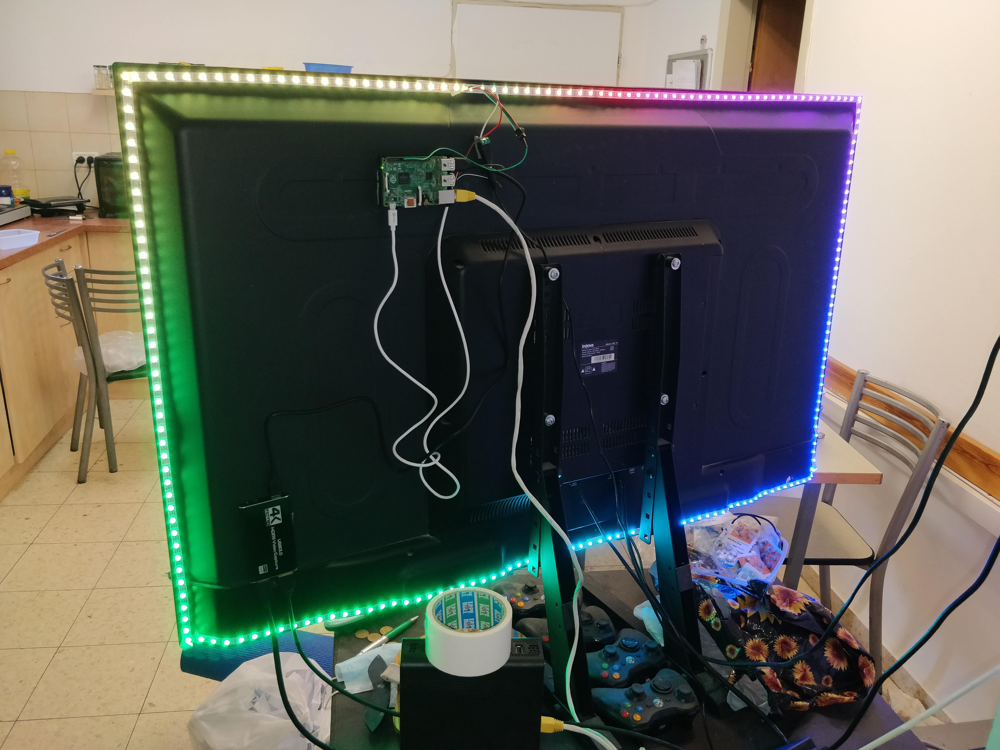

# Ambilight-TV
General guide to how to make Ambilight to your non-phillips TV with pictures and demonstration, using [raspberry pi](https://www.raspberrypi.com/products/raspberry-pi-zero/) and [hyperion](https://docs.hyperion-project.org/en/user/Installation.html) software. (Known also as back-light TV).

## Table Of Contents
- [Ambilight-TV](#ambilight-tv)
  * [Table Of Contents](#table-of-contents)
  * [Intro](#intro)
      - [Important Notes](#important-notes)
  * [Requirments](#requirments)
    + [To Order List (If you don't have already by chance)](#to-order-list--if-you-don-t-have-already-by-chance-)
    + [Optional List](#optional-list)
    + [Special Considerations](#special-considerations)
  * [Setup](#setup)
      - [Overview](#overview)
      - [step 1: Install Hyperion on your Raspberry Pi](#step-1--install-hyperion-on-your-raspberry-pi)
      - [step 2: Prepare the wire](#step-2--prepare-the-wire)
      - [step 3: Put the leds](#step-3--put-the-leds)
      - [step 4: Put the Capture Card and the raspberry pi](#step-4--put-the-capture-card-and-the-raspberry-pi)
      - [step 5: Get all together](#step-5--get-all-together)
  * [Demo](#demo)

<small><i><a href='http://ecotrust-canada.github.io/markdown-toc/'>Table of contents generated with markdown-toc</a></i></small>

## Intro
Hue Ambilight is known feature in [phillips' TV](https://www.youtube.com/watch?v=aH-4HxWgk1k). The TV equipped with back RGB leds behind the TV, they dynamically change the colour by the current value of the edge pixels of the TV's image. It began when I was impressed in personal from ambilight in my friend TV house. 
ecause this kind of TVs are usually more expensive, I decided to build my own ambilight to my non-phillips TV setup and share the result with some tips and info about the process.
Enjoy. 
Credits 
- ["The ULTIMATE Guide to Building an Ambilight TV with Hyperion"](https://www.youtube.com/watch?v=J26oYlKyq7Q) by ["Everything Smart Home"](https://www.youtube.com/c/EverythingSmartHome) 
- [Hyperion](https://docs.hyperion-project.org/en/user/Installation.html) Software to run on the raspberry pi which control the lights.
#### Important Notes
 -  This will work only if your source is external to the TV (like Xioami Streamer, Xbox Console or Blueray player), won't work for Smart-TV internal applications. In other words, if you play Netflix through your Xbox, it is OK, but if you play it from your Smart-TV's internal device, you won't see the ambilight effect
 -  The discussed setup was verified on 55" TV, if your TV is larger than 55" then you may need to modify the setup (please check [Special Considerations](#special-considerations)

## Requirments
A short list of everything you will need for the BackLight leds TV project
Links are suitable for shipping to Israel. Once you have all you good to go.
- A Television (Obviously) 
### To Order List (If you don't have already by chance)
- [ ] [4K Video Capture](https://www.aliexpress.com/wholesale?catId=0&initiative_id=SB_20220911092523&origin=y&SearchText=4K+USB+3.0+Video+Capture+Card+HDMI-compatible&spm=a2g0o.detail.1000002.0) - see [example](Images/RecordingCard.png)
- [ ] [Power Supply](https://www.aliexpress.com/wholesale?catId=0&initiative_id=SB_20220911093849&SearchText=DC+5V+12V+24V+lighting+transformer+AC+110V+220V+sw&spm=a2g0o.productlist.1000002.0) 5V, 5A and EU plug should be suffiecnt for 5m strip - see [example](Images/PowerSupply.png)
- [ ] [DC Power female connector](https://www.aliexpress.com/wholesale?SearchText=5%205mm%20x%202.5mm%20dc%20power%20plug%20female)You need only one piece - see [example](Images/Power-Connector.png)
- [ ] [LED Strip](https://www.aliexpress.com/wholesale?catId=0&initiative_id=SB_20220911101259&origin=y&SearchText=DC5V+WS2812B&spm=a2g0o.detail.1000002.0) - WS2812B ,Black/White PCB, 60 IP30, 5m is enough for 55” TV,if you have bigger TV size then check [Special Considerations](#special-considerations). You should measure your TV’s width and height if you are unsure. - see [example](Images/Leds.png)
- [ ] Any kind of [Raspberry Pi](https://piitel.co.il/cats/v1-3-p-zero/?src=raspberrypi) - even an old one is ok (I used Raspberry Pi 2)
    - [ ] In addition you will need [micro SD card](https://www.aliexpress.com/wholesale?catId=0&initiative_id=SB_20220911102936&origin=y&SearchText=4GB+micro+sd+card&spm=a2g0o.detail.1000002.0) of at least 4 GB

### Optional List
- [ ] [HDMI Switcher](https://www.aliexpress.com/wholesale?catId=0&initiative_id=SB_20220911093559&SearchText=hdmi+switcher+3+to+1+remote&spm=a2g0o.productlist.1000002.0) in case you have several devices to connected to  your TV (AppleTV and Xbox for example).
- [ ] **Simple Wire Stripper** - [buy](https://www.aliexpress.com/wholesale?catId=0&initiative_id=SB_20220911155257&SearchText=Durable+Wire+Stripper+Decrustation+Pliers+&spm=a2g0o.order_list.1000002.0) or borrow from one of your electricians friends, needed to connect the raspberry pi to the power supply.
- [ ] **Micro USB Cable** - [buy]( https://www.aliexpress.com/wholesale?catId=0&initiative_id=SB_20220911155346&SearchText=micro+usb+cable&spm=a2g0o.productlist.1000002.0) or use an old you already have if you don't mind to cut it
- [ ] **double side glue tape** - for sticking the raspberry pi and the capture box on the back of your TV. ([link](https://www.aliexpress.com/wholesale?catId=0&initiative_id=AS_20220911160510&origin=y&SearchText=2+sides+tape&spm=a2g0o.detail.1000002.0))

### Special Considerations
If your TV's size is bigger then 55" you may need to revise the next settings:
- **Leds Strip's Lenght:** You should measure the actual length of your height and width of your TV to check if you may need more then 5m strip.
- **Choosing the right Power Supply:** If you need more then 5m of led strip, you may need a bigger power supply. [This video](https://www.youtube.com/watch?v=1UprhxCzVuI) explains in brief how to calculate the needed watts for the Leds.

## Setup
After preparing all important stuff you are ready to go, follow the instructions of the video. 
Sometimes the setup can be confusing a little, but worry not. I added a few diagrams to make for clearfication. 
#### Overview 
The next graph demonstrate the connection of all compenents in the setup (if nothing is shown, try to present this in desktop mode).

- External Source - can be Xbox or Xioami Streamer.

The power of the rpi and leds

#### step 1: Install Hyperion on your Raspberry Pi
Please follow after the great [guide](https://docs.hyperion-project.org/en/user/HyperBian.html#requirements) that Hyperion Team made, you may also check this detailed [video](https://www.youtube.com/watch?v=J26oYlKyq7Q&t=770s) (chapters recomnded "Preparing the Pi OS" and "Installing Hyperion/HyperHDR") which I found useful.
###### **Note** 
if your raspberry pi's connection to local network is through wireless (WIFI) then you should consider follow [this](https://docs.hyperion-project.org/en/user/HyperBian.html#hyperbian-wifi) for easy access
#### step 2: Prepare the wire
Cut the micro-USB cable like [this](https://youtu.be/J26oYlKyq7Q?t=1195) while using the cutter (or any other way to your own preferation), in my case I had 4 cables, and used only the black and red to the DC connector (red to positive and black to negative), the LEDs came with black-red cables (for power) and connector cable )for data from raspberry pi).
should look like in the image 

#### step 3: Put the leds
Please refer to the same video as before but in [this time](https://youtu.be/J26oYlKyq7Q?t=1031) about putting the leds, DO NOT CUT THE WIRE, but try to bend the LED in the corners, your LEDs should be inculded with glue equipped on the strip to make the sticking the leds on your TV easier. 

#### step 4: Put the Capture Card and the raspberry pi 
I followed [this](https://youtu.be/J26oYlKyq7Q?t=1144) in the very same video, and got similiar setup. My Result 

#### step 5: Get all together
Assuming the you configured correctly the network connection, you should see your Raspberry Pi IP in your local Network, You should find it in your Router settings. Afterwards your Rpi powered by Hyperion should be accessaible by this address: http://IpOfYourPi:8090 which IpOfYourPi= The Ip you should fine. 
You should learn the tips for the settings using the same video but in the chapter of ["Configuring Hyperion/HyperHDR"](https://www.youtube.com/watch?v=J26oYlKyq7Q&t=1342s), I used the tip of downscaling resolution of the image in order to get better performance.
**Final Result** 

##### **Note**
I had some error in this part, which I can't recall the exaact message, but it was about Hyperion didn't started in kernel mode, and I had to SSH the Rpi in order to put some command I found on stack overflow - please leave a message if your encounter this.
## Demo
Some side to side of "Before-After" Videos
